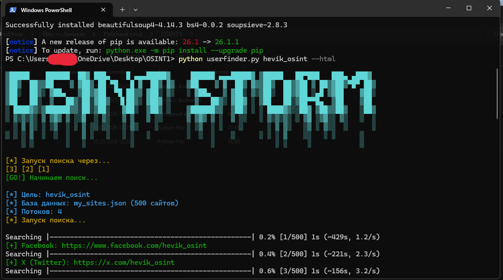

<div align="center">

# ⚡ OSINT STORM

### Advanced Username OSINT Tool



<br>


</div>

---

# 📌 About

**OSINT STORM** — инструмент для поиска аккаунтов и анализа цифрового следа по никнейму через открытые источники.

Утилита использует исключительно публичные API и открытые данные.  
Без взлома, брутфорса и получения закрытой информации.

---

# ⚙️ Features

- 🔎 Поиск аккаунтов по username
- 🌐 Проверка более 500 сервисов
- 📄 Генерация HTML-отчётов
- 📊 Визуализация найденных данных
- ⚡ Быстрый OSINT-анализ
- 🧠 AI-assisted обработка результатов

---

# 🚀 Installation

## Windows

Откройте папку проекта через терминал:

```bash
cd путь_к_папке
```

или:

- ПКМ по папке
- «Открыть в терминале»

---

# 🛠 Usage

## Шаг 1 — Запуск поиска

```bash
python userfinder.py username --html
```

### Пример:

```bash
python userfinder.py hevik --html
```

---

## Шаг 2 — Визуализация

```bash
python visualizer.py username
```

### Пример:

```bash
python visualizer.py hevik
```

---

# 📂 Reports

Все результаты сохраняются в папке:

```bash
report/
```

Откройте HTML-файлы через браузер для просмотра отчётов.

---

# 🧩 Example

```bash
python userfinder.py example_user --html
python visualizer.py example_user
```

---

# ⚠ Disclaimer

OSINT STORM предназначен исключительно для:

- OSINT-исследований
- Кибербезопасности
- Анализа открытых данных
- Образовательных целей

Автор не несёт ответственности за неправомерное использование инструмента.

---

# 🧠 Technologies

- Python
- HTML Reports
- Open API
- Data Visualization
- OSINT Automation

---

# 📈 Project Status

Проект активно развивается.  
База сервисов регулярно обновляется.

---

<div align="center">

### ⚡ OSINT STORM

Advanced OSINT Username Investigation Tool

</div>
